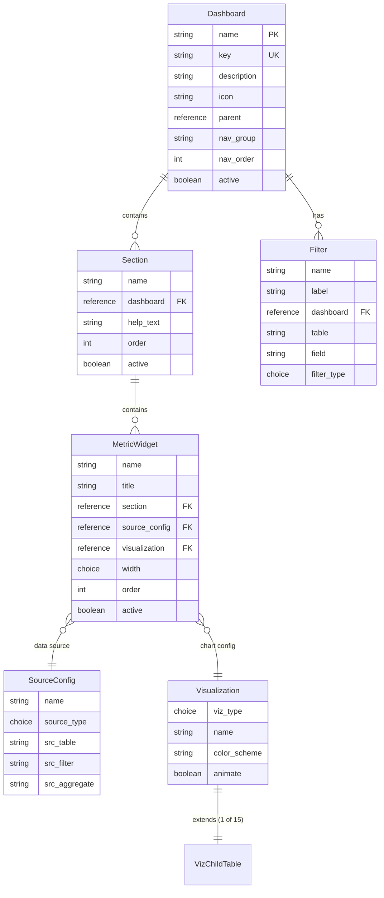

# D3 Metrics Portal (MetPo)

A ServiceNow scoped application that provides a configurable, data-driven metrics dashboard powered by D3.js visualizations. Administrators define dashboards, sections, and metric widgets through standard ServiceNow forms, while a workspace renders the configured metrics as interactive D3.js charts in real time.

| | |
|---|---|
| **Scope** | `x_1295779_metpo` |
| **Instance** | `dev414212.service-now.com` |
| **Workspace URL** | `/x/1295779/d3-metrics-portal` |

---

## Table of Contents

- [Architecture Overview](#architecture-overview)
- [Data Model](#data-model)
- [Visualization Types](#visualization-types)
- [Source Configuration](#source-configuration)
- [Server-Side Logic](#server-side-logic)
- [Client-Side Behavior](#client-side-behavior)
- [Navigation](#navigation)
- [Development Setup](#development-setup)
- [Key Files](#key-files)
- [Design Decisions](#design-decisions)

---

## Architecture Overview

The application follows a config-driven dashboard pattern:

```
┌─────────────────────────────────────────────────────────────────────┐
│ WORKSPACE (Frontend)                                                  │
│ /x/1295779/d3-metrics-portal                                          │
│                                                                       │
│   ┌──────────┐   ┌──────────┐   ┌──────────┐   ┌──────────┐          │
│   │  D3 Bar  │   │  D3 Pie  │   │ D3 Line  │   │ D3 Gauge │   ...     │
│   │  Chart   │   │  Chart   │   │  Chart   │   │          │          │
│   └──────────┘   └──────────┘   └──────────┘   └──────────┘          │
└───────────────────────────┬─────────────────────────────────────────┘
                            │ JSON payload
                            ▼
┌─────────────────────────────────────────────────────────────────────┐
│ MetricsResolver (Script Include)                                      │
│                                                                       │
│   resolve(dashboardKey, filters)                                      │
│     → Load Dashboard → Sections → Metric Widgets                      │
│     → Dispatch to Source Handler (per metric)                         │
│     → Merge Visualization Config                                      │
│     → Return hydrated JSON payload                                    │
└───────────────────────────┬─────────────────────────────────────────┘
                            │
          ┌─────────────────┼─────────────────┐
          ▼                 ▼                 ▼
  ┌──────────────┐  ┌──────────────┐  ┌──────────────┐
  │    Table     │  │      PA      │  │    Staged    │   + Scripted
  │  Aggregate   │  │  Indicator   │  │   External   │     Handler
  │   Handler    │  │   Handler    │  │   Handler    │
  └──────────────┘  └──────────────┘  └──────────────┘
```

**Workflow:**

1. Admin configures Dashboards → Sections → Metric Widgets via platform forms.
2. Each Metric Widget references a **Source Configuration** (where data comes from) and a **Visualization Config** (how to render it).
3. The `MetricsResolver` script include resolves the full dashboard into a JSON payload.
4. The workspace frontend consumes the payload and renders D3.js visualizations.
5. Filters (per-dashboard) allow end users to narrow metric data at runtime.

---

## Data Model



### Tables Summary

| Table | Label | Purpose |
|-------|-------|---------|
| `x_1295779_metpo_dashboard` | Dashboard | Top-level container grouping sections |
| `x_1295779_metpo_section` | Section | Groups metric widgets within a dashboard |
| `x_1295779_metpo_metric` | Metric Widget | Individual metric card with layout config |
| `x_1295779_metpo_source_config` | Source Configuration | Data source definition (separate from display) |
| `x_1295779_metpo_filter` | Filter | User-facing filters for dashboard data |
| `x_1295779_metpo_visualization` | Visualization Config | Base visualization properties (extensible) |
| `x_1295779_metpo_viz_*` (×15) | (various) | Type-specific visualization configs |

---

## Visualization Types

The application supports **15 visualization types**, each implemented as a child table extending `x_1295779_metpo_visualization`:

| Type | Table | Key Configuration |
|------|-------|-------------------|
| Column Chart | `viz_column` | stacked, horizontal, bar_gap, bar_radius, reference lines |
| Line Chart | `viz_line` | curve_type, stroke_width, area_fill, dots, step_line |
| Pie Chart | `viz_pie` | inner_radius (donut), pad_angle, start_angle, center_label |
| Scatter Chart | `viz_scatter` | dot_radius, regression, jitter, opacity |
| Heatmap | `viz_heatmap` | cell_radius, color_scale min/max, cell_gap |
| Sankey Diagram | `viz_sankey` | node_width, node_padding, link_opacity |
| Treemap | `viz_treemap` | tile_padding, tiling_method, tile_radius |
| Word Cloud | `viz_wordcloud` | font_min/max, rotation, spiral_type |
| Gauge | `viz_gauge` | min/max_value, arc_width, zones_config, needle_color |
| Choropleth Map | `viz_choropleth` | geo_json_url, projection, color_scale |
| Network Graph | `viz_network` | node_radius, link_distance, charge_strength, draggable |
| Radar Chart | `viz_radar` | axis_count, levels, max_value, area_opacity |
| Calendar Heatmap | `viz_calendar` | cell_size, week_start, month_gap, color_scale |
| Gantt Chart | `viz_gantt` | row_height, bar_radius, header_format, show_progress |
| Box Plot | `viz_boxplot` | box_width, whisker_style, show_mean, show_outliers |

All types share common properties: **dimensions, margins, color scheme, legend, tooltip, animation, border, and background** settings.

A wizard interceptor (15 `sys_wizard_answer` records) guides admins to create the correct child table record when clicking **New** on the Visualization list.

---

## Source Configuration

The Metric Source Configuration table defines where data comes from. Four source types are supported.

### Table Aggregate

Queries a ServiceNow table with grouping and aggregation:

- **Source Table** — which table to query
- **Filter Conditions** — encoded query (condition builder linked to source table)
- **Aggregate Function** — COUNT, SUM, AVG, MIN, MAX
- **Aggregate Field** — field to aggregate (field picker driven by source table)
- **Group By / Secondary Group By** — grouping dimensions
- **Order By / Limit** — sorting and result cap
- **X-Axis / Y-Axis Fields** — chart axis mapping
- **Source / Target Fields** — for relationship visualizations (Sankey, Network)

### PA Indicator

Pulls data from Performance Analytics:

- **PA Indicator** — reference to `pa_indicators`
- **PA Breakdown** — reference to `pa_breakdowns`
- **Breakdown Elements** — specific elements to include
- **Lookback Days** — historical window (default: 30)

### Staged External

Reads from a pre-loaded staging table:

- **Staging Table** — which staging table to read
- **Staging Filter** — filter conditions on the staging table
- **Label Field / Value Field** — which fields contain labels and values

### Scripted

Custom data via script include:

- **Script Include** — API name of the class
- **Method Name** — method to invoke
- **Parameters (JSON)** — arguments passed to the method

UI Policies dynamically show/hide fields based on the selected source type, and a client script clears all source fields when switching types.

---

## Server-Side Logic

### MetricsResolver (`x_1295779_metpo.MetricsResolver`)

The central orchestrator for the application. Key methods:

| Method | Purpose |
|--------|---------|
| `resolve(dashboardKey, filters)` | Main entry — loads full dashboard hierarchy, resolves data, returns payload |
| `getNavItems()` | Returns hierarchical navigation tree of active dashboards |
| `_loadSectionMetrics(sectionSysId, filterQuery)` | Loads metrics per section, dispatches to handlers |
| `_buildSourceConfig(metricGr, sourceType)` | Assembles source config object from record fields |
| `_loadFilterDefinitions(dashSysId)` | Loads filter definitions for a dashboard |
| `_buildFilterQuery(filters, filterDefs)` | Converts filter values to encoded query |
| `_resolveVisualizationConfig(vizSysId)` | Reads child viz table to extract all config fields |
| `_dispatch(sourceType, sourceConfig, vizType)` | Routes to appropriate data handler |

### Data Handlers

| Handler | Source Type | Strategy |
|---------|-------------|----------|
| `MetricsTableAggregateHandler` | `table_aggregate` | GlideAggregate queries |
| `MetricsPaIndicatorHandler` | `pa_indicator` | PA API integration |
| `MetricsStagedExternalHandler` | `staged_external` | Direct table reads |
| `MetricsScriptedHandler` | `scripted` | Dynamic class instantiation |

---

## Client-Side Behavior

| Type | Target | Trigger | Purpose |
|------|--------|---------|---------|
| Client Script (onLoad) | Visualization | Form load | Auto-sets `viz_type` from child table name, makes it read-only |
| Client Script (onChange) | Source Config | `source_type` change | Clears all source fields when type switches |
| UI Policy (×4) | Source Config | `source_type` value | Shows/hides relevant source fields per type |

---

## Navigation

The **D3 Metrics Portal** application menu provides:

```
📂 D3 Metrics Portal
├── 🔗 Open Metrics Portal → workspace
├── ── Configuration ───────────
│   ├── 📋 Dashboards
│   ├── 📋 Sections
│   ├── 📋 Metric Widgets
│   ├── 📋 Source Configurations
│   └── 📋 Filters
├── ── Visualizations ──────────
│   └── 📋 All Visualizations
```

---

## Development Setup

### Prerequisites

- ServiceNow SDK (`@servicenow/sdk`) v4.6.0+
- Node.js (per SDK requirements)
- Access to a ServiceNow instance with the `admin` role

### Project Structure

```
x_1295779_metpo/
├── src/
│   └── fluent/
│       ├── index.now.ts                      # Entry point
│       ├── app_menu.now.ts                   # Navigator menu & modules
│       ├── source_config_table.now.ts        # Source Configuration table
│       ├── source_config_form.now.ts         # Source Configuration form layout
│       ├── source_config_ui_policies.now.ts  # Conditional field visibility
│       ├── source_config_client_script.now.ts# Field clearing on type change
│       ├── metric_form.now.ts                # Metric Widget form layout
│       ├── viz_type_readonly.now.ts          # Visualization type auto-set
│       └── generated/                        # Auto-generated from instance
│           ├── keys.ts                        # ID registry
│           ├── data/table/                    # 17 table definitions
│           ├── other/sys-wizard-answer/       # Viz interceptor wizard
│           ├── client-development/ui-policy/  # Legacy UI policies
│           └── server-development/            # MetricsResolver script include
├── @types/                                   # ServiceNow type definitions
├── now.config.json                           # SDK configuration
├── package.json                              # Dependencies & scripts
└── tsconfig.json                             # TypeScript configuration
```

### Build & Deploy

```bash
# Install dependencies
npm install

# Build the application
npx now-sdk build

# Deploy to instance
npx now-sdk install
```

---

## Key Files

| File | Description |
|------|-------------|
| `source_config_table.now.ts` | Defines the Source Configuration table with all conditional fields |
| `source_config_ui_policies.now.ts` | 4 UI policies controlling field visibility by source type |
| `source_config_client_script.now.ts` | Clears stale data when switching source types |
| `metric_form.now.ts` | Metric Widget form: name, title, section, source_config, visualization, width |
| `source_config_form.now.ts` | Source Config form with General + tabbed Source Configuration sections |
| `viz_type_readonly.now.ts` | Locks `viz_type` field on child visualization tables |
| `app_menu.now.ts` | Full navigator menu with workspace link and table modules |
| `generated/.../MetricsResolver` | Central server-side orchestration logic |

---

## Design Decisions

1. **Separation of Concerns** — Source configuration and visualization configuration are independent tables, allowing mix-and-match combinations and potential reuse across metrics.

2. **Extensible Visualization Hierarchy** — A base visualization table with 15 child tables allows type-specific config while sharing common properties (colors, margins, legend, animation).

3. **Config-Driven Architecture** — No code changes needed to add new dashboards, sections, or metrics. Everything is configured through standard ServiceNow forms.

4. **Dynamic Form Behavior** — UI Policies and client scripts ensure clean forms that only show relevant fields based on the selected source type.

5. **Wizard-Based Creation** — The visualization interceptor guides users to the correct child table, preventing misconfigured records.

6. **Handler Pattern** — The `MetricsResolver` dispatches to specialized handler classes per source type, making it easy to add new data sources without modifying core logic.
